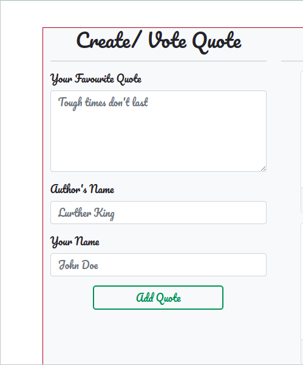
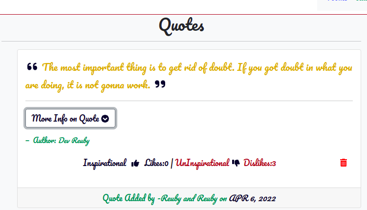

# QuotesApp

##### Reuben Kipkemboi 

## Table of Content

+ [Description](#description)
+ [Installation Requirement](#installation)
+ [Technology Used](#technologies-used)
+ [License](#license)
+ [Authors Info](#authors-info)

# Description.
This project was generated with [Angular CLI](https://github.com/angular/angular-cli) version 13.3.1.

A basic angular application where users can be able to add a simple or favourite quote, Enter the name of the author of the quote and then add the quote.The details of the quote are shown and the user is able to delete the quote at his or her wish.

### **Add your best quote**

### **Sample quotes with their details**

# User Stories
As a user :
* Create a new Vote
* Upvote and downvote a quote
* Delete quote
* See the number of upvotes and number of downvotes for each quote.

## Behaviour Driven Development
Add Quote through a form.

 * Use of a form to enter quote and quote details.

View quote details

* On click of more details button the user can view the details of the quote just as entered.

Delete Quote from quote list.

* Use of a delete icon to delete the user quote

## Installation
## Development server

Run `ng serve` for a dev server. Navigate to `http://localhost:4200/`. The application will automatically reload if you change any of the source files.

## Code scaffolding

Run `ng generate component component-name` to generate a new component. You can also use `ng generate directive|pipe|service|class|guard|interface|enum|module`.

## Build

Run `ng build` to build the project. The build artifacts will be stored in the `dist/` directory.

## Running unit tests

Run `ng test` to execute the unit tests via [Karma](https://karma-runner.github.io).

## Running end-to-end tests

Run `ng e2e` to execute the end-to-end tests via a platform of your choice. To use this command, you need to first add a package that implements end-to-end testing capabilities.

[Go Back to the top](#quoteapp)

## Technologies Used
* Angular CLI - Generation of basic application configuration.
* Html - Structure Application layout.
* CSS and Bootstrap 5 - styling of the application .

[Go Back to the top](#quoteapp)

## License
[MIT License](LICENSE)

## Authors Info
* Slack - [Reuben Kipkemboi]()

* Email - [Reuben Kipkemboi](https://gmail.com)

# live site
* #### 

## Further help

To get more help on the Angular CLI use `ng help` or go check out the [Angular CLI Overview and Command Reference](https://angular.io/cli) page.
